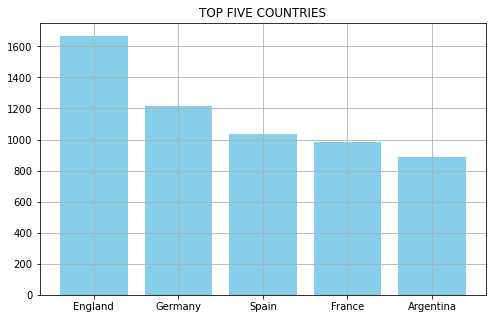
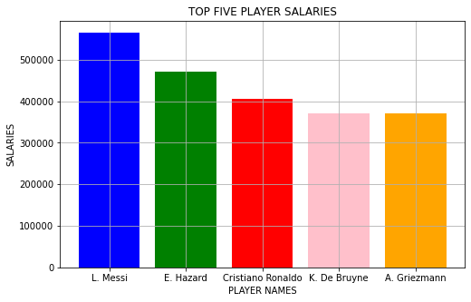

# <center> ANALYSIS OF FOOTBALL DATA  </center>

### <center> USING PYTHON </center>

#### Libraries used : 
    (i)   Seaborn
    (ii)  Pandas
    (iii) Matplotlib(pyplot)


```python
# importing Libraries 
```


```python
import pandas as pd 
import seaborn as sns
from matplotlib import pyplot as plt
```


```python
# First Load the CSV file
```


```python
fifaData = pd.read_csv('fifaData.csv')
```


```python
fifaData.head()
```


<div>
<style scoped>
    .dataframe tbody tr th:only-of-type {
        vertical-align: middle;
    }

    .dataframe tbody tr th {
        vertical-align: top;
    }

    .dataframe thead th {
        text-align: right;
    }
</style>
<table border="1" class="dataframe">
  <thead>
    <tr style="text-align: right;">
      <th></th>
      <th>sofifa_id</th>
      <th>player_url</th>
      <th>short_name</th>
      <th>long_name</th>
      <th>age</th>
      <th>dob</th>
      <th>height_cm</th>
      <th>weight_kg</th>
      <th>nationality</th>
      <th>club</th>
      <th>...</th>
      <th>lwb</th>
      <th>ldm</th>
      <th>cdm</th>
      <th>rdm</th>
      <th>rwb</th>
      <th>lb</th>
      <th>lcb</th>
      <th>cb</th>
      <th>rcb</th>
      <th>rb</th>
    </tr>
  </thead>
  <tbody>
    <tr>
      <th>0</th>
      <td>158023</td>
      <td>https://sofifa.com/player/158023/lionel-messi/...</td>
      <td>L. Messi</td>
      <td>Lionel Andrés Messi Cuccittini</td>
      <td>32</td>
      <td>1987-06-24</td>
      <td>170</td>
      <td>72</td>
      <td>Argentina</td>
      <td>FC Barcelona</td>
      <td>...</td>
      <td>68+2</td>
      <td>66+2</td>
      <td>66+2</td>
      <td>66+2</td>
      <td>68+2</td>
      <td>63+2</td>
      <td>52+2</td>
      <td>52+2</td>
      <td>52+2</td>
      <td>63+2</td>
    </tr>
    <tr>
      <th>1</th>
      <td>20801</td>
      <td>https://sofifa.com/player/20801/c-ronaldo-dos-...</td>
      <td>Cristiano Ronaldo</td>
      <td>Cristiano Ronaldo dos Santos Aveiro</td>
      <td>34</td>
      <td>1985-02-05</td>
      <td>187</td>
      <td>83</td>
      <td>Portugal</td>
      <td>Juventus</td>
      <td>...</td>
      <td>65+3</td>
      <td>61+3</td>
      <td>61+3</td>
      <td>61+3</td>
      <td>65+3</td>
      <td>61+3</td>
      <td>53+3</td>
      <td>53+3</td>
      <td>53+3</td>
      <td>61+3</td>
    </tr>
    <tr>
      <th>2</th>
      <td>190871</td>
      <td>https://sofifa.com/player/190871/neymar-da-sil...</td>
      <td>Neymar Jr</td>
      <td>Neymar da Silva Santos Junior</td>
      <td>27</td>
      <td>1992-02-05</td>
      <td>175</td>
      <td>68</td>
      <td>Brazil</td>
      <td>Paris Saint-Germain</td>
      <td>...</td>
      <td>66+3</td>
      <td>61+3</td>
      <td>61+3</td>
      <td>61+3</td>
      <td>66+3</td>
      <td>61+3</td>
      <td>46+3</td>
      <td>46+3</td>
      <td>46+3</td>
      <td>61+3</td>
    </tr>
    <tr>
      <th>3</th>
      <td>200389</td>
      <td>https://sofifa.com/player/200389/jan-oblak/20/...</td>
      <td>J. Oblak</td>
      <td>Jan Oblak</td>
      <td>26</td>
      <td>1993-01-07</td>
      <td>188</td>
      <td>87</td>
      <td>Slovenia</td>
      <td>Atlético Madrid</td>
      <td>...</td>
      <td>NaN</td>
      <td>NaN</td>
      <td>NaN</td>
      <td>NaN</td>
      <td>NaN</td>
      <td>NaN</td>
      <td>NaN</td>
      <td>NaN</td>
      <td>NaN</td>
      <td>NaN</td>
    </tr>
    <tr>
      <th>4</th>
      <td>183277</td>
      <td>https://sofifa.com/player/183277/eden-hazard/2...</td>
      <td>E. Hazard</td>
      <td>Eden Hazard</td>
      <td>28</td>
      <td>1991-01-07</td>
      <td>175</td>
      <td>74</td>
      <td>Belgium</td>
      <td>Real Madrid</td>
      <td>...</td>
      <td>66+3</td>
      <td>63+3</td>
      <td>63+3</td>
      <td>63+3</td>
      <td>66+3</td>
      <td>61+3</td>
      <td>49+3</td>
      <td>49+3</td>
      <td>49+3</td>
      <td>61+3</td>
    </tr>
  </tbody>
</table>
<p>5 rows × 104 columns</p>
</div>


```python
for col in fifaData.columns:  # All Columns in this DataSet
    print(col)
```

    sofifa_id
    player_url
    short_name
    long_name
    age
    dob
    height_cm
    weight_kg
    nationality
    club
    overall
    potential
    value_eur
    wage_eur
    player_positions
    preferred_foot
    international_reputation
    weak_foot
    skill_moves
    work_rate
    body_type
    real_face
    release_clause_eur
    player_tags
    team_position
    team_jersey_number
    loaned_from
    joined
    contract_valid_until
    nation_position
    nation_jersey_number
    pace
    shooting
    passing
    dribbling
    defending
    physic
    gk_diving
    gk_handling
    gk_kicking
    gk_reflexes
    gk_speed
    gk_positioning
    player_traits
    attacking_crossing
    attacking_finishing
    attacking_heading_accuracy
    attacking_short_passing
    attacking_volleys
    skill_dribbling
    skill_curve
    skill_fk_accuracy
    skill_long_passing
    skill_ball_control
    movement_acceleration
    movement_sprint_speed
    movement_agility
    movement_reactions
    movement_balance
    power_shot_power
    power_jumping
    power_stamina
    power_strength
    power_long_shots
    mentality_aggression
    mentality_interceptions
    mentality_positioning
    mentality_vision
    mentality_penalties
    mentality_composure
    defending_marking
    defending_standing_tackle
    defending_sliding_tackle
    goalkeeping_diving
    goalkeeping_handling
    goalkeeping_kicking
    goalkeeping_positioning
    goalkeeping_reflexes
    ls
    st
    rs
    lw
    lf
    cf
    rf
    rw
    lam
    cam
    ram
    lm
    lcm
    cm
    rcm
    rm
    lwb
    ldm
    cdm
    rdm
    rwb
    lb
    lcb
    cb
    rcb
    rb
    


```python
fifaData.shape # Huge Dataset
```


    (18278, 104)


```python
fifaData['nationality'].value_counts()
```


    England           1667
    Germany           1216
    Spain             1035
    France             984
    Argentina          886
                      ... 
    Belize               1
    Puerto Rico          1
    Indonesia            1
    Jordan               1
    Chinese Taipei       1
    Name: nationality, Length: 162, dtype: int64


## It shows that most of the player belongs to England


```python
fifaData['nationality'].value_counts()[0:10]
```


    England        1667
    Germany        1216
    Spain          1035
    France          984
    Argentina       886
    Brazil          824
    Italy           732
    Colombia        591
    Japan           453
    Netherlands     416
    Name: nationality, dtype: int64


```python
firstFiveCountriesNames = fifaData['nationality'].value_counts()[0:5].keys()    # Extracting Names of Country
firstFiveCountries
```


    Index(['England', 'Germany', 'Spain', 'France', 'Argentina'], dtype='object')


```python
firstFiveCountriesPlayers = fifaData['nationality'].value_counts()[0:5]   # Extracting Total no.of Players from these Country
```


```python
plt.figure(figsize=(8,5))
plt.bar(firstFiveCountriesNames,firstFiveCountriesPlayers,color='skyblue')
plt.title('TOP FIVE COUNTRIES')
plt.grid(True)
plt.show()
```


    

    


```python
# Now Creating Bar chart to show the salaries of top 5 player
```


```python
playerSalaryData = fifaData[["short_name",'wage_eur']]
PSD = playerSalaryData.sort_values(by=['wage_eur'],ascending= False)
PS.head()
```


<div>
<style scoped>
    .dataframe tbody tr th:only-of-type {
        vertical-align: middle;
    }

    .dataframe tbody tr th {
        vertical-align: top;
    }

    .dataframe thead th {
        text-align: right;
    }
</style>
<table border="1" class="dataframe">
  <thead>
    <tr style="text-align: right;">
      <th></th>
      <th>short_name</th>
      <th>wage_eur</th>
    </tr>
  </thead>
  <tbody>
    <tr>
      <th>0</th>
      <td>L. Messi</td>
      <td>565000</td>
    </tr>
    <tr>
      <th>4</th>
      <td>E. Hazard</td>
      <td>470000</td>
    </tr>
    <tr>
      <th>1</th>
      <td>Cristiano Ronaldo</td>
      <td>405000</td>
    </tr>
    <tr>
      <th>5</th>
      <td>K. De Bruyne</td>
      <td>370000</td>
    </tr>
    <tr>
      <th>22</th>
      <td>A. Griezmann</td>
      <td>370000</td>
    </tr>
  </tbody>
</table>
</div>


```python
playersName = PSD['short_name'].head(5)  # creating variable for Players Name
playersSalary = PSD['wage_eur'].head(5)  # creating variable for Players Salaries
```


```python
plt.figure(figsize=(8,5))
plt.bar(playersName,playersSalary,color=['b','g','r','pink','orange'])
plt.title('TOP FIVE PLAYER SALARIES')
plt.ylabel("SALARIES")
plt.xlabel('PLAYER NAMES')
plt.grid(True)
plt.show()
```


    

    


### PLAYERS THAT BELONG TO GERMANY :


```python
fifaData["nationality"]=='Germany'
germanyPlayers = fifaData[fifaData["nationality"]=='Germany']
germanyPlayers.head(10)
```


<div>
<style scoped>
    .dataframe tbody tr th:only-of-type {
        vertical-align: middle;
    }

    .dataframe tbody tr th {
        vertical-align: top;
    }

    .dataframe thead th {
        text-align: right;
    }
</style>
<table border="1" class="dataframe">
  <thead>
    <tr style="text-align: right;">
      <th></th>
      <th>sofifa_id</th>
      <th>player_url</th>
      <th>short_name</th>
      <th>long_name</th>
      <th>age</th>
      <th>dob</th>
      <th>height_cm</th>
      <th>weight_kg</th>
      <th>nationality</th>
      <th>club</th>
      <th>...</th>
      <th>lwb</th>
      <th>ldm</th>
      <th>cdm</th>
      <th>rdm</th>
      <th>rwb</th>
      <th>lb</th>
      <th>lcb</th>
      <th>cb</th>
      <th>rcb</th>
      <th>rb</th>
    </tr>
  </thead>
  <tbody>
    <tr>
      <th>6</th>
      <td>192448</td>
      <td>https://sofifa.com/player/192448/marc-andre-te...</td>
      <td>M. ter Stegen</td>
      <td>Marc-André ter Stegen</td>
      <td>27</td>
      <td>1992-04-30</td>
      <td>187</td>
      <td>85</td>
      <td>Germany</td>
      <td>FC Barcelona</td>
      <td>...</td>
      <td>NaN</td>
      <td>NaN</td>
      <td>NaN</td>
      <td>NaN</td>
      <td>NaN</td>
      <td>NaN</td>
      <td>NaN</td>
      <td>NaN</td>
      <td>NaN</td>
      <td>NaN</td>
    </tr>
    <tr>
      <th>31</th>
      <td>167495</td>
      <td>https://sofifa.com/player/167495/manuel-neuer/...</td>
      <td>M. Neuer</td>
      <td>Manuel Neuer</td>
      <td>33</td>
      <td>1986-03-27</td>
      <td>193</td>
      <td>92</td>
      <td>Germany</td>
      <td>FC Bayern München</td>
      <td>...</td>
      <td>NaN</td>
      <td>NaN</td>
      <td>NaN</td>
      <td>NaN</td>
      <td>NaN</td>
      <td>NaN</td>
      <td>NaN</td>
      <td>NaN</td>
      <td>NaN</td>
      <td>NaN</td>
    </tr>
    <tr>
      <th>36</th>
      <td>182521</td>
      <td>https://sofifa.com/player/182521/toni-kroos/20...</td>
      <td>T. Kroos</td>
      <td>Toni Kroos</td>
      <td>29</td>
      <td>1990-01-04</td>
      <td>183</td>
      <td>76</td>
      <td>Germany</td>
      <td>Real Madrid</td>
      <td>...</td>
      <td>75+3</td>
      <td>79+3</td>
      <td>79+3</td>
      <td>79+3</td>
      <td>75+3</td>
      <td>72+3</td>
      <td>69+3</td>
      <td>69+3</td>
      <td>69+3</td>
      <td>72+3</td>
    </tr>
    <tr>
      <th>37</th>
      <td>188350</td>
      <td>https://sofifa.com/player/188350/marco-reus/20...</td>
      <td>M. Reus</td>
      <td>Marco Reus</td>
      <td>30</td>
      <td>1989-05-31</td>
      <td>180</td>
      <td>71</td>
      <td>Germany</td>
      <td>Borussia Dortmund</td>
      <td>...</td>
      <td>69+3</td>
      <td>65+3</td>
      <td>65+3</td>
      <td>65+3</td>
      <td>69+3</td>
      <td>64+3</td>
      <td>55+3</td>
      <td>55+3</td>
      <td>55+3</td>
      <td>64+3</td>
    </tr>
    <tr>
      <th>49</th>
      <td>178603</td>
      <td>https://sofifa.com/player/178603/mats-hummels/...</td>
      <td>M. Hummels</td>
      <td>Mats  Hummels</td>
      <td>30</td>
      <td>1988-12-16</td>
      <td>191</td>
      <td>94</td>
      <td>Germany</td>
      <td>Borussia Dortmund</td>
      <td>...</td>
      <td>77+3</td>
      <td>83+3</td>
      <td>83+3</td>
      <td>83+3</td>
      <td>77+3</td>
      <td>78+3</td>
      <td>84+3</td>
      <td>84+3</td>
      <td>84+3</td>
      <td>78+3</td>
    </tr>
    <tr>
      <th>55</th>
      <td>222492</td>
      <td>https://sofifa.com/player/222492/leroy-sane/20...</td>
      <td>L. Sané</td>
      <td>Leroy Sané</td>
      <td>23</td>
      <td>1996-01-11</td>
      <td>183</td>
      <td>75</td>
      <td>Germany</td>
      <td>Manchester City</td>
      <td>...</td>
      <td>65+2</td>
      <td>59+2</td>
      <td>59+2</td>
      <td>59+2</td>
      <td>65+2</td>
      <td>61+2</td>
      <td>52+2</td>
      <td>52+2</td>
      <td>52+2</td>
      <td>61+2</td>
    </tr>
    <tr>
      <th>61</th>
      <td>212622</td>
      <td>https://sofifa.com/player/212622/joshua-kimmic...</td>
      <td>J. Kimmich</td>
      <td>Joshua Kimmich</td>
      <td>24</td>
      <td>1995-02-08</td>
      <td>176</td>
      <td>73</td>
      <td>Germany</td>
      <td>FC Bayern München</td>
      <td>...</td>
      <td>83+3</td>
      <td>82+3</td>
      <td>82+3</td>
      <td>82+3</td>
      <td>83+3</td>
      <td>81+3</td>
      <td>78+3</td>
      <td>78+3</td>
      <td>78+3</td>
      <td>81+3</td>
    </tr>
    <tr>
      <th>70</th>
      <td>189596</td>
      <td>https://sofifa.com/player/189596/thomas-muller...</td>
      <td>T. Müller</td>
      <td>Thomas Müller</td>
      <td>29</td>
      <td>1989-09-13</td>
      <td>186</td>
      <td>75</td>
      <td>Germany</td>
      <td>FC Bayern München</td>
      <td>...</td>
      <td>69+3</td>
      <td>68+3</td>
      <td>68+3</td>
      <td>68+3</td>
      <td>69+3</td>
      <td>67+3</td>
      <td>62+3</td>
      <td>62+3</td>
      <td>62+3</td>
      <td>67+3</td>
    </tr>
    <tr>
      <th>77</th>
      <td>212190</td>
      <td>https://sofifa.com/player/212190/niklas-sule/2...</td>
      <td>N. Süle</td>
      <td>Niklas Süle</td>
      <td>23</td>
      <td>1995-09-03</td>
      <td>195</td>
      <td>97</td>
      <td>Germany</td>
      <td>FC Bayern München</td>
      <td>...</td>
      <td>71+2</td>
      <td>77+2</td>
      <td>77+2</td>
      <td>77+2</td>
      <td>71+2</td>
      <td>75+2</td>
      <td>83+2</td>
      <td>83+2</td>
      <td>83+2</td>
      <td>75+2</td>
    </tr>
    <tr>
      <th>109</th>
      <td>235790</td>
      <td>https://sofifa.com/player/235790/kai-havertz/2...</td>
      <td>K. Havertz</td>
      <td>Kai Havertz</td>
      <td>20</td>
      <td>1999-06-11</td>
      <td>188</td>
      <td>83</td>
      <td>Germany</td>
      <td>Bayer 04 Leverkusen</td>
      <td>...</td>
      <td>65+2</td>
      <td>63+2</td>
      <td>63+2</td>
      <td>63+2</td>
      <td>65+2</td>
      <td>62+2</td>
      <td>54+2</td>
      <td>54+2</td>
      <td>54+2</td>
      <td>62+2</td>
    </tr>
  </tbody>
</table>
<p>10 rows × 104 columns</p>
</div>


#### Sorting Player by their Height :


```python
germanyPlayers.sort_values(by=['height_cm'],ascending=False).head()
```


<div>
<style scoped>
    .dataframe tbody tr th:only-of-type {
        vertical-align: middle;
    }

    .dataframe tbody tr th {
        vertical-align: top;
    }

    .dataframe thead th {
        text-align: right;
    }
</style>
<table border="1" class="dataframe">
  <thead>
    <tr style="text-align: right;">
      <th></th>
      <th>sofifa_id</th>
      <th>player_url</th>
      <th>short_name</th>
      <th>long_name</th>
      <th>age</th>
      <th>dob</th>
      <th>height_cm</th>
      <th>weight_kg</th>
      <th>nationality</th>
      <th>club</th>
      <th>...</th>
      <th>lwb</th>
      <th>ldm</th>
      <th>cdm</th>
      <th>rdm</th>
      <th>rwb</th>
      <th>lb</th>
      <th>lcb</th>
      <th>cb</th>
      <th>rcb</th>
      <th>rb</th>
    </tr>
  </thead>
  <tbody>
    <tr>
      <th>8016</th>
      <td>236831</td>
      <td>https://sofifa.com/player/236831/aaron-seydel/...</td>
      <td>A. Seydel</td>
      <td>Aaron Seydel</td>
      <td>23</td>
      <td>1996-02-07</td>
      <td>199</td>
      <td>90</td>
      <td>Germany</td>
      <td>1. FSV Mainz 05</td>
      <td>...</td>
      <td>46+2</td>
      <td>43+2</td>
      <td>43+2</td>
      <td>43+2</td>
      <td>46+2</td>
      <td>44+2</td>
      <td>43+2</td>
      <td>43+2</td>
      <td>43+2</td>
      <td>44+2</td>
    </tr>
    <tr>
      <th>1217</th>
      <td>200212</td>
      <td>https://sofifa.com/player/200212/michael-esser...</td>
      <td>M. Esser</td>
      <td>Michael Esser</td>
      <td>31</td>
      <td>1987-11-22</td>
      <td>198</td>
      <td>97</td>
      <td>Germany</td>
      <td>Hannover 96</td>
      <td>...</td>
      <td>NaN</td>
      <td>NaN</td>
      <td>NaN</td>
      <td>NaN</td>
      <td>NaN</td>
      <td>NaN</td>
      <td>NaN</td>
      <td>NaN</td>
      <td>NaN</td>
      <td>NaN</td>
    </tr>
    <tr>
      <th>1389</th>
      <td>199833</td>
      <td>https://sofifa.com/player/199833/lars-unnersta...</td>
      <td>L. Unnerstall</td>
      <td>Lars Unnerstall</td>
      <td>28</td>
      <td>1990-07-20</td>
      <td>198</td>
      <td>103</td>
      <td>Germany</td>
      <td>PSV</td>
      <td>...</td>
      <td>NaN</td>
      <td>NaN</td>
      <td>NaN</td>
      <td>NaN</td>
      <td>NaN</td>
      <td>NaN</td>
      <td>NaN</td>
      <td>NaN</td>
      <td>NaN</td>
      <td>NaN</td>
    </tr>
    <tr>
      <th>11859</th>
      <td>167437</td>
      <td>https://sofifa.com/player/167437/dominik-stroh...</td>
      <td>D. Stroh-Engel</td>
      <td>Dominik Stroh-Engel</td>
      <td>33</td>
      <td>1985-11-27</td>
      <td>197</td>
      <td>94</td>
      <td>Germany</td>
      <td>SpVgg Unterhaching</td>
      <td>...</td>
      <td>39+2</td>
      <td>45+2</td>
      <td>45+2</td>
      <td>45+2</td>
      <td>39+2</td>
      <td>39+2</td>
      <td>47+2</td>
      <td>47+2</td>
      <td>47+2</td>
      <td>39+2</td>
    </tr>
    <tr>
      <th>13576</th>
      <td>239746</td>
      <td>https://sofifa.com/player/239746/lukas-watkowi...</td>
      <td>L. Watkowiak</td>
      <td>Lukas Watkowiak</td>
      <td>23</td>
      <td>1996-03-06</td>
      <td>197</td>
      <td>103</td>
      <td>Germany</td>
      <td>SV Wehen Wiesbaden</td>
      <td>...</td>
      <td>NaN</td>
      <td>NaN</td>
      <td>NaN</td>
      <td>NaN</td>
      <td>NaN</td>
      <td>NaN</td>
      <td>NaN</td>
      <td>NaN</td>
      <td>NaN</td>
      <td>NaN</td>
    </tr>
  </tbody>
</table>
<p>5 rows × 104 columns</p>
</div>


#### Sorting players by their Weight :


```python
germanyPlayers.sort_values(by=['weight_kg'],ascending=False).head()
```


<div>
<style scoped>
    .dataframe tbody tr th:only-of-type {
        vertical-align: middle;
    }

    .dataframe tbody tr th {
        vertical-align: top;
    }

    .dataframe thead th {
        text-align: right;
    }
</style>
<table border="1" class="dataframe">
  <thead>
    <tr style="text-align: right;">
      <th></th>
      <th>sofifa_id</th>
      <th>player_url</th>
      <th>short_name</th>
      <th>long_name</th>
      <th>age</th>
      <th>dob</th>
      <th>height_cm</th>
      <th>weight_kg</th>
      <th>nationality</th>
      <th>club</th>
      <th>...</th>
      <th>lwb</th>
      <th>ldm</th>
      <th>cdm</th>
      <th>rdm</th>
      <th>rwb</th>
      <th>lb</th>
      <th>lcb</th>
      <th>cb</th>
      <th>rcb</th>
      <th>rb</th>
    </tr>
  </thead>
  <tbody>
    <tr>
      <th>13576</th>
      <td>239746</td>
      <td>https://sofifa.com/player/239746/lukas-watkowi...</td>
      <td>L. Watkowiak</td>
      <td>Lukas Watkowiak</td>
      <td>23</td>
      <td>1996-03-06</td>
      <td>197</td>
      <td>103</td>
      <td>Germany</td>
      <td>SV Wehen Wiesbaden</td>
      <td>...</td>
      <td>NaN</td>
      <td>NaN</td>
      <td>NaN</td>
      <td>NaN</td>
      <td>NaN</td>
      <td>NaN</td>
      <td>NaN</td>
      <td>NaN</td>
      <td>NaN</td>
      <td>NaN</td>
    </tr>
    <tr>
      <th>1389</th>
      <td>199833</td>
      <td>https://sofifa.com/player/199833/lars-unnersta...</td>
      <td>L. Unnerstall</td>
      <td>Lars Unnerstall</td>
      <td>28</td>
      <td>1990-07-20</td>
      <td>198</td>
      <td>103</td>
      <td>Germany</td>
      <td>PSV</td>
      <td>...</td>
      <td>NaN</td>
      <td>NaN</td>
      <td>NaN</td>
      <td>NaN</td>
      <td>NaN</td>
      <td>NaN</td>
      <td>NaN</td>
      <td>NaN</td>
      <td>NaN</td>
      <td>NaN</td>
    </tr>
    <tr>
      <th>518</th>
      <td>179783</td>
      <td>https://sofifa.com/player/179783/ralf-fahrmann...</td>
      <td>R. Fährmann</td>
      <td>Ralf Fährmann</td>
      <td>30</td>
      <td>1988-09-27</td>
      <td>197</td>
      <td>98</td>
      <td>Germany</td>
      <td>Norwich City</td>
      <td>...</td>
      <td>NaN</td>
      <td>NaN</td>
      <td>NaN</td>
      <td>NaN</td>
      <td>NaN</td>
      <td>NaN</td>
      <td>NaN</td>
      <td>NaN</td>
      <td>NaN</td>
      <td>NaN</td>
    </tr>
    <tr>
      <th>1217</th>
      <td>200212</td>
      <td>https://sofifa.com/player/200212/michael-esser...</td>
      <td>M. Esser</td>
      <td>Michael Esser</td>
      <td>31</td>
      <td>1987-11-22</td>
      <td>198</td>
      <td>97</td>
      <td>Germany</td>
      <td>Hannover 96</td>
      <td>...</td>
      <td>NaN</td>
      <td>NaN</td>
      <td>NaN</td>
      <td>NaN</td>
      <td>NaN</td>
      <td>NaN</td>
      <td>NaN</td>
      <td>NaN</td>
      <td>NaN</td>
      <td>NaN</td>
    </tr>
    <tr>
      <th>77</th>
      <td>212190</td>
      <td>https://sofifa.com/player/212190/niklas-sule/2...</td>
      <td>N. Süle</td>
      <td>Niklas Süle</td>
      <td>23</td>
      <td>1995-09-03</td>
      <td>195</td>
      <td>97</td>
      <td>Germany</td>
      <td>FC Bayern München</td>
      <td>...</td>
      <td>71+2</td>
      <td>77+2</td>
      <td>77+2</td>
      <td>77+2</td>
      <td>71+2</td>
      <td>75+2</td>
      <td>83+2</td>
      <td>83+2</td>
      <td>83+2</td>
      <td>75+2</td>
    </tr>
  </tbody>
</table>
<p>5 rows × 104 columns</p>
</div>


#### Sorting German players by their Salaries


```python
germanyPlayers.sort_values(by=['wage_eur'],ascending=False).head()
```


<div>
<style scoped>
    .dataframe tbody tr th:only-of-type {
        vertical-align: middle;
    }

    .dataframe tbody tr th {
        vertical-align: top;
    }

    .dataframe thead th {
        text-align: right;
    }
</style>
<table border="1" class="dataframe">
  <thead>
    <tr style="text-align: right;">
      <th></th>
      <th>sofifa_id</th>
      <th>player_url</th>
      <th>short_name</th>
      <th>long_name</th>
      <th>age</th>
      <th>dob</th>
      <th>height_cm</th>
      <th>weight_kg</th>
      <th>nationality</th>
      <th>club</th>
      <th>...</th>
      <th>lwb</th>
      <th>ldm</th>
      <th>cdm</th>
      <th>rdm</th>
      <th>rwb</th>
      <th>lb</th>
      <th>lcb</th>
      <th>cb</th>
      <th>rcb</th>
      <th>rb</th>
    </tr>
  </thead>
  <tbody>
    <tr>
      <th>36</th>
      <td>182521</td>
      <td>https://sofifa.com/player/182521/toni-kroos/20...</td>
      <td>T. Kroos</td>
      <td>Toni Kroos</td>
      <td>29</td>
      <td>1990-01-04</td>
      <td>183</td>
      <td>76</td>
      <td>Germany</td>
      <td>Real Madrid</td>
      <td>...</td>
      <td>75+3</td>
      <td>79+3</td>
      <td>79+3</td>
      <td>79+3</td>
      <td>75+3</td>
      <td>72+3</td>
      <td>69+3</td>
      <td>69+3</td>
      <td>69+3</td>
      <td>72+3</td>
    </tr>
    <tr>
      <th>6</th>
      <td>192448</td>
      <td>https://sofifa.com/player/192448/marc-andre-te...</td>
      <td>M. ter Stegen</td>
      <td>Marc-André ter Stegen</td>
      <td>27</td>
      <td>1992-04-30</td>
      <td>187</td>
      <td>85</td>
      <td>Germany</td>
      <td>FC Barcelona</td>
      <td>...</td>
      <td>NaN</td>
      <td>NaN</td>
      <td>NaN</td>
      <td>NaN</td>
      <td>NaN</td>
      <td>NaN</td>
      <td>NaN</td>
      <td>NaN</td>
      <td>NaN</td>
      <td>NaN</td>
    </tr>
    <tr>
      <th>55</th>
      <td>222492</td>
      <td>https://sofifa.com/player/222492/leroy-sane/20...</td>
      <td>L. Sané</td>
      <td>Leroy Sané</td>
      <td>23</td>
      <td>1996-01-11</td>
      <td>183</td>
      <td>75</td>
      <td>Germany</td>
      <td>Manchester City</td>
      <td>...</td>
      <td>65+2</td>
      <td>59+2</td>
      <td>59+2</td>
      <td>59+2</td>
      <td>65+2</td>
      <td>61+2</td>
      <td>52+2</td>
      <td>52+2</td>
      <td>52+2</td>
      <td>61+2</td>
    </tr>
    <tr>
      <th>146</th>
      <td>186942</td>
      <td>https://sofifa.com/player/186942/ilkay-gundoga...</td>
      <td>I. Gündoğan</td>
      <td>İlkay Gündoğan</td>
      <td>28</td>
      <td>1990-10-24</td>
      <td>180</td>
      <td>80</td>
      <td>Germany</td>
      <td>Manchester City</td>
      <td>...</td>
      <td>76+3</td>
      <td>79+3</td>
      <td>79+3</td>
      <td>79+3</td>
      <td>76+3</td>
      <td>74+3</td>
      <td>72+3</td>
      <td>72+3</td>
      <td>72+3</td>
      <td>74+3</td>
    </tr>
    <tr>
      <th>70</th>
      <td>189596</td>
      <td>https://sofifa.com/player/189596/thomas-muller...</td>
      <td>T. Müller</td>
      <td>Thomas Müller</td>
      <td>29</td>
      <td>1989-09-13</td>
      <td>186</td>
      <td>75</td>
      <td>Germany</td>
      <td>FC Bayern München</td>
      <td>...</td>
      <td>69+3</td>
      <td>68+3</td>
      <td>68+3</td>
      <td>68+3</td>
      <td>69+3</td>
      <td>67+3</td>
      <td>62+3</td>
      <td>62+3</td>
      <td>62+3</td>
      <td>67+3</td>
    </tr>
  </tbody>
</table>
<p>5 rows × 104 columns</p>
</div>


## PLAYER WITH BEST SHOOTING RANGE :


```python
playerShooting = fifaData[['short_name','shooting']]
playerShooting.sort_values(by=['shooting'],ascending=False).head(10)
```


<div>
<style scoped>
    .dataframe tbody tr th:only-of-type {
        vertical-align: middle;
    }

    .dataframe tbody tr th {
        vertical-align: top;
    }

    .dataframe thead th {
        text-align: right;
    }
</style>
<table border="1" class="dataframe">
  <thead>
    <tr style="text-align: right;">
      <th></th>
      <th>short_name</th>
      <th>shooting</th>
    </tr>
  </thead>
  <tbody>
    <tr>
      <th>1</th>
      <td>Cristiano Ronaldo</td>
      <td>93.0</td>
    </tr>
    <tr>
      <th>0</th>
      <td>L. Messi</td>
      <td>92.0</td>
    </tr>
    <tr>
      <th>12</th>
      <td>H. Kane</td>
      <td>91.0</td>
    </tr>
    <tr>
      <th>17</th>
      <td>S. Agüero</td>
      <td>90.0</td>
    </tr>
    <tr>
      <th>205</th>
      <td>F. Quagliarella</td>
      <td>89.0</td>
    </tr>
    <tr>
      <th>19</th>
      <td>L. Suárez</td>
      <td>89.0</td>
    </tr>
    <tr>
      <th>96</th>
      <td>Z. Ibrahimović</td>
      <td>88.0</td>
    </tr>
    <tr>
      <th>37</th>
      <td>M. Reus</td>
      <td>88.0</td>
    </tr>
    <tr>
      <th>100</th>
      <td>G. Bale</td>
      <td>87.0</td>
    </tr>
    <tr>
      <th>20</th>
      <td>R. Lewandowski</td>
      <td>87.0</td>
    </tr>
  </tbody>
</table>
</div>


## PLAYER WITH BEST DEFENDING RATING :


```python
playerShooting = fifaData[['short_name','nationality','club','defending']]
playerShooting.sort_values(by=['defending'],ascending=False).head(10)
```


<div>
<style scoped>
    .dataframe tbody tr th:only-of-type {
        vertical-align: middle;
    }

    .dataframe tbody tr th {
        vertical-align: top;
    }

    .dataframe thead th {
        text-align: right;
    }
</style>
<table border="1" class="dataframe">
  <thead>
    <tr style="text-align: right;">
      <th></th>
      <th>short_name</th>
      <th>nationality</th>
      <th>club</th>
      <th>defending</th>
    </tr>
  </thead>
  <tbody>
    <tr>
      <th>16</th>
      <td>G. Chiellini</td>
      <td>Italy</td>
      <td>Juventus</td>
      <td>90.0</td>
    </tr>
    <tr>
      <th>7</th>
      <td>V. van Dijk</td>
      <td>Netherlands</td>
      <td>Liverpool</td>
      <td>90.0</td>
    </tr>
    <tr>
      <th>11</th>
      <td>K. Koulibaly</td>
      <td>Senegal</td>
      <td>Napoli</td>
      <td>89.0</td>
    </tr>
    <tr>
      <th>35</th>
      <td>D. Godín</td>
      <td>Uruguay</td>
      <td>Inter</td>
      <td>89.0</td>
    </tr>
    <tr>
      <th>49</th>
      <td>M. Hummels</td>
      <td>Germany</td>
      <td>Borussia Dortmund</td>
      <td>89.0</td>
    </tr>
    <tr>
      <th>29</th>
      <td>Piqué</td>
      <td>Spain</td>
      <td>FC Barcelona</td>
      <td>88.0</td>
    </tr>
    <tr>
      <th>50</th>
      <td>T. Alderweireld</td>
      <td>Belgium</td>
      <td>Tottenham Hotspur</td>
      <td>88.0</td>
    </tr>
    <tr>
      <th>40</th>
      <td>A. Laporte</td>
      <td>France</td>
      <td>Manchester City</td>
      <td>88.0</td>
    </tr>
    <tr>
      <th>47</th>
      <td>J. Vertonghen</td>
      <td>Belgium</td>
      <td>Tottenham Hotspur</td>
      <td>87.0</td>
    </tr>
    <tr>
      <th>67</th>
      <td>L. Bonucci</td>
      <td>Italy</td>
      <td>Juventus</td>
      <td>87.0</td>
    </tr>
  </tbody>
</table>
</div>


#### Analysing Real Madrid Players


```python
realMadrid = fifaData[fifaData['club'] == 'Real Madrid']
realMadrid.head()
```


<div>
<style scoped>
    .dataframe tbody tr th:only-of-type {
        vertical-align: middle;
    }

    .dataframe tbody tr th {
        vertical-align: top;
    }

    .dataframe thead th {
        text-align: right;
    }
</style>
<table border="1" class="dataframe">
  <thead>
    <tr style="text-align: right;">
      <th></th>
      <th>sofifa_id</th>
      <th>player_url</th>
      <th>short_name</th>
      <th>long_name</th>
      <th>age</th>
      <th>dob</th>
      <th>height_cm</th>
      <th>weight_kg</th>
      <th>nationality</th>
      <th>club</th>
      <th>...</th>
      <th>lwb</th>
      <th>ldm</th>
      <th>cdm</th>
      <th>rdm</th>
      <th>rwb</th>
      <th>lb</th>
      <th>lcb</th>
      <th>cb</th>
      <th>rcb</th>
      <th>rb</th>
    </tr>
  </thead>
  <tbody>
    <tr>
      <th>4</th>
      <td>183277</td>
      <td>https://sofifa.com/player/183277/eden-hazard/2...</td>
      <td>E. Hazard</td>
      <td>Eden Hazard</td>
      <td>28</td>
      <td>1991-01-07</td>
      <td>175</td>
      <td>74</td>
      <td>Belgium</td>
      <td>Real Madrid</td>
      <td>...</td>
      <td>66+3</td>
      <td>63+3</td>
      <td>63+3</td>
      <td>63+3</td>
      <td>66+3</td>
      <td>61+3</td>
      <td>49+3</td>
      <td>49+3</td>
      <td>49+3</td>
      <td>61+3</td>
    </tr>
    <tr>
      <th>8</th>
      <td>177003</td>
      <td>https://sofifa.com/player/177003/luka-modric/2...</td>
      <td>L. Modrić</td>
      <td>Luka Modrić</td>
      <td>33</td>
      <td>1985-09-09</td>
      <td>172</td>
      <td>66</td>
      <td>Croatia</td>
      <td>Real Madrid</td>
      <td>...</td>
      <td>81+3</td>
      <td>81+3</td>
      <td>81+3</td>
      <td>81+3</td>
      <td>81+3</td>
      <td>79+3</td>
      <td>72+3</td>
      <td>72+3</td>
      <td>72+3</td>
      <td>79+3</td>
    </tr>
    <tr>
      <th>18</th>
      <td>155862</td>
      <td>https://sofifa.com/player/155862/sergio-ramos-...</td>
      <td>Sergio Ramos</td>
      <td>Sergio Ramos García</td>
      <td>33</td>
      <td>1986-03-30</td>
      <td>184</td>
      <td>82</td>
      <td>Spain</td>
      <td>Real Madrid</td>
      <td>...</td>
      <td>80+3</td>
      <td>84+3</td>
      <td>84+3</td>
      <td>84+3</td>
      <td>80+3</td>
      <td>82+3</td>
      <td>87+3</td>
      <td>87+3</td>
      <td>87+3</td>
      <td>82+3</td>
    </tr>
    <tr>
      <th>28</th>
      <td>192119</td>
      <td>https://sofifa.com/player/192119/thibaut-court...</td>
      <td>T. Courtois</td>
      <td>Thibaut Courtois</td>
      <td>27</td>
      <td>1992-05-11</td>
      <td>199</td>
      <td>96</td>
      <td>Belgium</td>
      <td>Real Madrid</td>
      <td>...</td>
      <td>NaN</td>
      <td>NaN</td>
      <td>NaN</td>
      <td>NaN</td>
      <td>NaN</td>
      <td>NaN</td>
      <td>NaN</td>
      <td>NaN</td>
      <td>NaN</td>
      <td>NaN</td>
    </tr>
    <tr>
      <th>36</th>
      <td>182521</td>
      <td>https://sofifa.com/player/182521/toni-kroos/20...</td>
      <td>T. Kroos</td>
      <td>Toni Kroos</td>
      <td>29</td>
      <td>1990-01-04</td>
      <td>183</td>
      <td>76</td>
      <td>Germany</td>
      <td>Real Madrid</td>
      <td>...</td>
      <td>75+3</td>
      <td>79+3</td>
      <td>79+3</td>
      <td>79+3</td>
      <td>75+3</td>
      <td>72+3</td>
      <td>69+3</td>
      <td>69+3</td>
      <td>69+3</td>
      <td>72+3</td>
    </tr>
  </tbody>
</table>
<p>5 rows × 104 columns</p>
</div>


```python
realMadrid.sort_values(by=['wage_eur'],ascending=False).head()
```


<div>
<style scoped>
    .dataframe tbody tr th:only-of-type {
        vertical-align: middle;
    }

    .dataframe tbody tr th {
        vertical-align: top;
    }

    .dataframe thead th {
        text-align: right;
    }
</style>
<table border="1" class="dataframe">
  <thead>
    <tr style="text-align: right;">
      <th></th>
      <th>sofifa_id</th>
      <th>player_url</th>
      <th>short_name</th>
      <th>long_name</th>
      <th>age</th>
      <th>dob</th>
      <th>height_cm</th>
      <th>weight_kg</th>
      <th>nationality</th>
      <th>club</th>
      <th>...</th>
      <th>lwb</th>
      <th>ldm</th>
      <th>cdm</th>
      <th>rdm</th>
      <th>rwb</th>
      <th>lb</th>
      <th>lcb</th>
      <th>cb</th>
      <th>rcb</th>
      <th>rb</th>
    </tr>
  </thead>
  <tbody>
    <tr>
      <th>4</th>
      <td>183277</td>
      <td>https://sofifa.com/player/183277/eden-hazard/2...</td>
      <td>E. Hazard</td>
      <td>Eden Hazard</td>
      <td>28</td>
      <td>1991-01-07</td>
      <td>175</td>
      <td>74</td>
      <td>Belgium</td>
      <td>Real Madrid</td>
      <td>...</td>
      <td>66+3</td>
      <td>63+3</td>
      <td>63+3</td>
      <td>63+3</td>
      <td>66+3</td>
      <td>61+3</td>
      <td>49+3</td>
      <td>49+3</td>
      <td>49+3</td>
      <td>61+3</td>
    </tr>
    <tr>
      <th>8</th>
      <td>177003</td>
      <td>https://sofifa.com/player/177003/luka-modric/2...</td>
      <td>L. Modrić</td>
      <td>Luka Modrić</td>
      <td>33</td>
      <td>1985-09-09</td>
      <td>172</td>
      <td>66</td>
      <td>Croatia</td>
      <td>Real Madrid</td>
      <td>...</td>
      <td>81+3</td>
      <td>81+3</td>
      <td>81+3</td>
      <td>81+3</td>
      <td>81+3</td>
      <td>79+3</td>
      <td>72+3</td>
      <td>72+3</td>
      <td>72+3</td>
      <td>79+3</td>
    </tr>
    <tr>
      <th>36</th>
      <td>182521</td>
      <td>https://sofifa.com/player/182521/toni-kroos/20...</td>
      <td>T. Kroos</td>
      <td>Toni Kroos</td>
      <td>29</td>
      <td>1990-01-04</td>
      <td>183</td>
      <td>76</td>
      <td>Germany</td>
      <td>Real Madrid</td>
      <td>...</td>
      <td>75+3</td>
      <td>79+3</td>
      <td>79+3</td>
      <td>79+3</td>
      <td>75+3</td>
      <td>72+3</td>
      <td>69+3</td>
      <td>69+3</td>
      <td>69+3</td>
      <td>72+3</td>
    </tr>
    <tr>
      <th>18</th>
      <td>155862</td>
      <td>https://sofifa.com/player/155862/sergio-ramos-...</td>
      <td>Sergio Ramos</td>
      <td>Sergio Ramos García</td>
      <td>33</td>
      <td>1986-03-30</td>
      <td>184</td>
      <td>82</td>
      <td>Spain</td>
      <td>Real Madrid</td>
      <td>...</td>
      <td>80+3</td>
      <td>84+3</td>
      <td>84+3</td>
      <td>84+3</td>
      <td>80+3</td>
      <td>82+3</td>
      <td>87+3</td>
      <td>87+3</td>
      <td>87+3</td>
      <td>82+3</td>
    </tr>
    <tr>
      <th>46</th>
      <td>165153</td>
      <td>https://sofifa.com/player/165153/karim-benzema...</td>
      <td>K. Benzema</td>
      <td>Karim Benzema</td>
      <td>31</td>
      <td>1987-12-19</td>
      <td>185</td>
      <td>81</td>
      <td>France</td>
      <td>Real Madrid</td>
      <td>...</td>
      <td>62+3</td>
      <td>62+3</td>
      <td>62+3</td>
      <td>62+3</td>
      <td>62+3</td>
      <td>58+3</td>
      <td>54+3</td>
      <td>54+3</td>
      <td>54+3</td>
      <td>58+3</td>
    </tr>
  </tbody>
</table>
<p>5 rows × 104 columns</p>
</div>


```python
realMadrid.sort_values(by=['shooting'],ascending=False).head()
```


<div>
<style scoped>
    .dataframe tbody tr th:only-of-type {
        vertical-align: middle;
    }

    .dataframe tbody tr th {
        vertical-align: top;
    }

    .dataframe thead th {
        text-align: right;
    }
</style>
<table border="1" class="dataframe">
  <thead>
    <tr style="text-align: right;">
      <th></th>
      <th>sofifa_id</th>
      <th>player_url</th>
      <th>short_name</th>
      <th>long_name</th>
      <th>age</th>
      <th>dob</th>
      <th>height_cm</th>
      <th>weight_kg</th>
      <th>nationality</th>
      <th>club</th>
      <th>...</th>
      <th>lwb</th>
      <th>ldm</th>
      <th>cdm</th>
      <th>rdm</th>
      <th>rwb</th>
      <th>lb</th>
      <th>lcb</th>
      <th>cb</th>
      <th>rcb</th>
      <th>rb</th>
    </tr>
  </thead>
  <tbody>
    <tr>
      <th>100</th>
      <td>173731</td>
      <td>https://sofifa.com/player/173731/gareth-bale/2...</td>
      <td>G. Bale</td>
      <td>Gareth Frank Bale</td>
      <td>29</td>
      <td>1989-07-16</td>
      <td>185</td>
      <td>82</td>
      <td>Wales</td>
      <td>Real Madrid</td>
      <td>...</td>
      <td>72+3</td>
      <td>69+3</td>
      <td>69+3</td>
      <td>69+3</td>
      <td>72+3</td>
      <td>70+3</td>
      <td>66+3</td>
      <td>66+3</td>
      <td>66+3</td>
      <td>70+3</td>
    </tr>
    <tr>
      <th>106</th>
      <td>198710</td>
      <td>https://sofifa.com/player/198710/james-rodrigu...</td>
      <td>J. Rodríguez</td>
      <td>James David Rodríguez Rubio</td>
      <td>27</td>
      <td>1991-07-12</td>
      <td>180</td>
      <td>75</td>
      <td>Colombia</td>
      <td>Real Madrid</td>
      <td>...</td>
      <td>67+3</td>
      <td>67+3</td>
      <td>67+3</td>
      <td>67+3</td>
      <td>67+3</td>
      <td>62+3</td>
      <td>57+3</td>
      <td>57+3</td>
      <td>57+3</td>
      <td>62+3</td>
    </tr>
    <tr>
      <th>4</th>
      <td>183277</td>
      <td>https://sofifa.com/player/183277/eden-hazard/2...</td>
      <td>E. Hazard</td>
      <td>Eden Hazard</td>
      <td>28</td>
      <td>1991-01-07</td>
      <td>175</td>
      <td>74</td>
      <td>Belgium</td>
      <td>Real Madrid</td>
      <td>...</td>
      <td>66+3</td>
      <td>63+3</td>
      <td>63+3</td>
      <td>63+3</td>
      <td>66+3</td>
      <td>61+3</td>
      <td>49+3</td>
      <td>49+3</td>
      <td>49+3</td>
      <td>61+3</td>
    </tr>
    <tr>
      <th>46</th>
      <td>165153</td>
      <td>https://sofifa.com/player/165153/karim-benzema...</td>
      <td>K. Benzema</td>
      <td>Karim Benzema</td>
      <td>31</td>
      <td>1987-12-19</td>
      <td>185</td>
      <td>81</td>
      <td>France</td>
      <td>Real Madrid</td>
      <td>...</td>
      <td>62+3</td>
      <td>62+3</td>
      <td>62+3</td>
      <td>62+3</td>
      <td>62+3</td>
      <td>58+3</td>
      <td>54+3</td>
      <td>54+3</td>
      <td>54+3</td>
      <td>58+3</td>
    </tr>
    <tr>
      <th>161</th>
      <td>232432</td>
      <td>https://sofifa.com/player/232432/luka-jovic/20...</td>
      <td>L. Jović</td>
      <td>Luka Jović</td>
      <td>21</td>
      <td>1997-12-23</td>
      <td>182</td>
      <td>85</td>
      <td>Serbia</td>
      <td>Real Madrid</td>
      <td>...</td>
      <td>55+2</td>
      <td>53+2</td>
      <td>53+2</td>
      <td>53+2</td>
      <td>55+2</td>
      <td>51+2</td>
      <td>47+2</td>
      <td>47+2</td>
      <td>47+2</td>
      <td>51+2</td>
    </tr>
  </tbody>
</table>
<p>5 rows × 104 columns</p>
</div>


```python
realMadrid.sort_values(by=['defending'],ascending=False).head()
```


<div>
<style scoped>
    .dataframe tbody tr th:only-of-type {
        vertical-align: middle;
    }

    .dataframe tbody tr th {
        vertical-align: top;
    }

    .dataframe thead th {
        text-align: right;
    }
</style>
<table border="1" class="dataframe">
  <thead>
    <tr style="text-align: right;">
      <th></th>
      <th>sofifa_id</th>
      <th>player_url</th>
      <th>short_name</th>
      <th>long_name</th>
      <th>age</th>
      <th>dob</th>
      <th>height_cm</th>
      <th>weight_kg</th>
      <th>nationality</th>
      <th>club</th>
      <th>...</th>
      <th>lwb</th>
      <th>ldm</th>
      <th>cdm</th>
      <th>rdm</th>
      <th>rwb</th>
      <th>lb</th>
      <th>lcb</th>
      <th>cb</th>
      <th>rcb</th>
      <th>rb</th>
    </tr>
  </thead>
  <tbody>
    <tr>
      <th>18</th>
      <td>155862</td>
      <td>https://sofifa.com/player/155862/sergio-ramos-...</td>
      <td>Sergio Ramos</td>
      <td>Sergio Ramos García</td>
      <td>33</td>
      <td>1986-03-30</td>
      <td>184</td>
      <td>82</td>
      <td>Spain</td>
      <td>Real Madrid</td>
      <td>...</td>
      <td>80+3</td>
      <td>84+3</td>
      <td>84+3</td>
      <td>84+3</td>
      <td>80+3</td>
      <td>82+3</td>
      <td>87+3</td>
      <td>87+3</td>
      <td>87+3</td>
      <td>82+3</td>
    </tr>
    <tr>
      <th>42</th>
      <td>200145</td>
      <td>https://sofifa.com/player/200145/carlos-henriq...</td>
      <td>Casemiro</td>
      <td>Carlos Henrique Venancio Casimiro</td>
      <td>27</td>
      <td>1992-02-23</td>
      <td>185</td>
      <td>84</td>
      <td>Brazil</td>
      <td>Real Madrid</td>
      <td>...</td>
      <td>78+3</td>
      <td>84+3</td>
      <td>84+3</td>
      <td>84+3</td>
      <td>78+3</td>
      <td>79+3</td>
      <td>84+3</td>
      <td>84+3</td>
      <td>84+3</td>
      <td>79+3</td>
    </tr>
    <tr>
      <th>76</th>
      <td>201535</td>
      <td>https://sofifa.com/player/201535/raphael-varan...</td>
      <td>R. Varane</td>
      <td>Raphaël Varane</td>
      <td>26</td>
      <td>1993-04-25</td>
      <td>191</td>
      <td>81</td>
      <td>France</td>
      <td>Real Madrid</td>
      <td>...</td>
      <td>74+3</td>
      <td>79+3</td>
      <td>79+3</td>
      <td>79+3</td>
      <td>74+3</td>
      <td>77+3</td>
      <td>83+3</td>
      <td>83+3</td>
      <td>83+3</td>
      <td>77+3</td>
    </tr>
    <tr>
      <th>94</th>
      <td>204963</td>
      <td>https://sofifa.com/player/204963/daniel-carvaj...</td>
      <td>Carvajal</td>
      <td>Daniel Carvajal Ramos</td>
      <td>27</td>
      <td>1992-01-11</td>
      <td>173</td>
      <td>73</td>
      <td>Spain</td>
      <td>Real Madrid</td>
      <td>...</td>
      <td>83+3</td>
      <td>82+3</td>
      <td>82+3</td>
      <td>82+3</td>
      <td>83+3</td>
      <td>83+3</td>
      <td>80+3</td>
      <td>80+3</td>
      <td>80+3</td>
      <td>83+3</td>
    </tr>
    <tr>
      <th>332</th>
      <td>240130</td>
      <td>https://sofifa.com/player/240130/eder-gabriel-...</td>
      <td>Éder Militão</td>
      <td>Éder Gabriel Militão</td>
      <td>21</td>
      <td>1998-01-18</td>
      <td>186</td>
      <td>78</td>
      <td>Brazil</td>
      <td>Real Madrid</td>
      <td>...</td>
      <td>78+2</td>
      <td>76+2</td>
      <td>76+2</td>
      <td>76+2</td>
      <td>78+2</td>
      <td>78+2</td>
      <td>79+2</td>
      <td>79+2</td>
      <td>79+2</td>
      <td>78+2</td>
    </tr>
  </tbody>
</table>
<p>5 rows × 104 columns</p>
</div>


```python
realMadrid['nationality'].value_counts()
```


    Spain                 13
    Brazil                 6
    France                 3
    Belgium                2
    Dominican Republic     1
    Colombia               1
    Wales                  1
    Japan                  1
    Uruguay                1
    Croatia                1
    Costa Rica             1
    Germany                1
    Serbia                 1
    Name: nationality, dtype: int64


# <center> PROJECT BY @YASIRKHANA. </center>

# <center> THE END  </center>


```python

```
